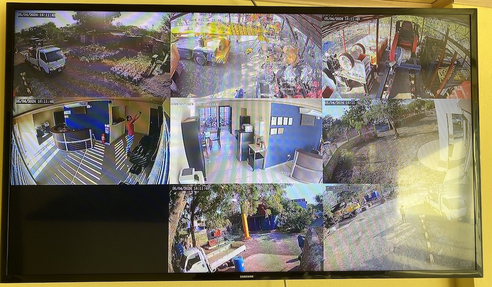

# nbplayer
Realtime pico(tiny)-player for cameras system.

Http requester, v4l2 decoder and direct-to-screen renderer.

# What is it?

First, is a minimalistic player for 24/7 cameras streams. 

Second, it is a test-metrics-and-stress-bed for learning, experiementing and optimizing code.

Dependencies to the minimun, it can run on minimal installation of Linux without graphical interface.

# Where it runs?

I'm using this on raspberry-pi-3-B, raspberry-pi-4-B and Jetson-Nano-2GB; minimal Debian and Ubuntu installations, no X-server or graphical interfaces installed or running.

It can run as a daemon, redering on screen after the device is booted without the need to log-in.

It is currently running on both versions of v4l: raspberry-pi uses v4l2 API, Jetson-Nano uses v4l (old) API.

# How to compile?

A single file: nbplayer.c

Assuming Linux-Debian-11 minimal installation:

    sudo apt update
    sudo apt install gcc libv4l-dev
    cc ./nbplayer.c -o nbplayer -lv4l2

# How to run?

    ./nbplayer [params]

Parameters:

    --help: prints this text
    
    Global options

    -dcb, --disableCursorBlinking : disables the cursor blinking
    -t, --extraThreads num        : extra threads for rendering
    -cto, --connTimeout num       : seconds without conn activity to restart connection
    -crc, --connWaitReconnect num : seconds to wait before reconnect
    -dto, --decTimeout num        : seconds without decoder output to restart decoder
    -dro, --decWaitReopen num     : seconds to wait before reopen decoder device
    -aw, --animWait num           : seconds between animation steps
    -fps, --framesPerSec num      : screen frames/refresh per second
    
    Screens options

    -fb, --frameBuffer path       : adds a framebuffer device (like '/dev/fb0')
    
    Decoders options

    -dec, --decoder path          : set the path to decoder device (like '/dev/video0') for next streams
    -srv, --server name/ip        : set the name/ip to server for next streams
    -p, --port num                : set the port number for next streams
    -s, --stream path             : adds a stream source (http resource path)
    
    Debug options

    --secsRunAndExit num          : seconds after starting to automatically activate stop-flag and exit, for debug and test
    --secsSleepBeforeExit num     : seconds to sleep before exiting the main() funcion, for memory leak detection
    --simNetworkTimeout num       : (1/num) probability to trigger a simulated network timeout, for cleanup code test
    --simDecoderTimeout num       : (1/num) probability to trigger a simulated decoder timeout, for cleanup code test

Example:

    ./nbplayer --disableCursorBlinking --animWait 15 --framesPerSec 25 --frameBuffer /dev/fb0 --frameBuffer /dev/fb1 --decoder /dev/video10 --server 127.0.0.1 --port 80 --stream /stream.h.264?src=cam-01 --stream /stream.h.264?src=cam-02 --server 192.168.1.100 --port 81 --stream /stream.h.264?src=cam-03

This command:

- disables the cursor blinking
- opens two screens (framebuffers '/dev/fb0' and '/dev/fb1')
- adds stream "http://127.0.0.1:80/stream.h.264?src=cam-01"
- adds stream "http://127.0.0.1:80/stream.h.264?src=cam-02"
- adds stream "http://192.168.1.100:81/stream.h.264?src=cam-03"
- starts rendering directly on the screen, refreshing 25 times-per-second.
- each 15 seconds, the rows are moved one position up, to reduce the image burning on the screen/TV.

    Notes:
    - if any connection is lost, it will try to reconnect after a short wait.
    - if a decoder stops producing (invalid compressed data), it will be reopened after a short wait.

# How to run automatically after each boot?

- Create a file `nbplayer.service.run.sh` containing your run command: `./nbplayer ...`.

- Create a file nbplayer.service.cfg describing your daemon/service:

    Note: Replace `/home/me' for the appropiate path.

    >[Unit] 
    >Description=nbplayer 
    >After=network.target 
    > 
    >[Service] 
    >Type=simple 
    >TimeoutStartSec=0 
    >WorkingDirectory=/home/me 
    >ExecStart=/bin/bash /home/me/nbplayer.service.run.sh 
    >Restart=on-failure 
    >RestartSec=2s 
    > 
    >[Install] 
    >WantedBy=default.target 

- Add your service to the system:

    >sudo chmod +x nbplayer.service.run.sh 
    >sudo cp nbplayer.service.cfg /usr/lib/systemd/system/nbplayer.service 
    >sudo systemctl daemon-reload 

- Enable your service for automatic start:

    >sudo systemctl enable nbplayer 

- Other useful commands:

    >sudo systemctl start nbplayer 
    >sudo systemctl stop nbplayer 
    >sudo systemctl restart nbplayer 
    >sudo systemctl status nbplayer 
    >sudo systemctl disable nbplayer 

# Multithread?

Framebuffers and decoders are non-blocking and managed on the main thread. 

The decoding usually is hardware accelerated (no cpu usage), but the rendering on screen is made by memcpying lines of pixels. If `--extraThreads n` is specified, then `n` ammount of extra threads are created for rendering on screen.

Previous to rendering (memcpying), the job is analyzed and ordered in lines that maximize the cpu-cache-hit, then the lines are grouped and assigned proportionally to the main and extra threads.

So far, `--extraThreads 0` (default) is enough for rendering two 1080p screens at 25fps with a 3x3 grid of videos on each; keeping one core 80-90% bussy.

If speed is a requirement and power-consumption/heat-production are not an issue, the sweetspot seem to be 2 threads per screen (including the main thread): `n = ((screens * 2) - 1)`.

# Why?

I'm building a streaming software for multiple platforms; this player helps me to experiment with minimalistic environments and hardware to produce robust code on my other library.

This program is intended for efficiency and stability on the devices I'm running it; it should run stable 24/7. Memory leaks are constantly tested, including the ones produced by the decoder driver.